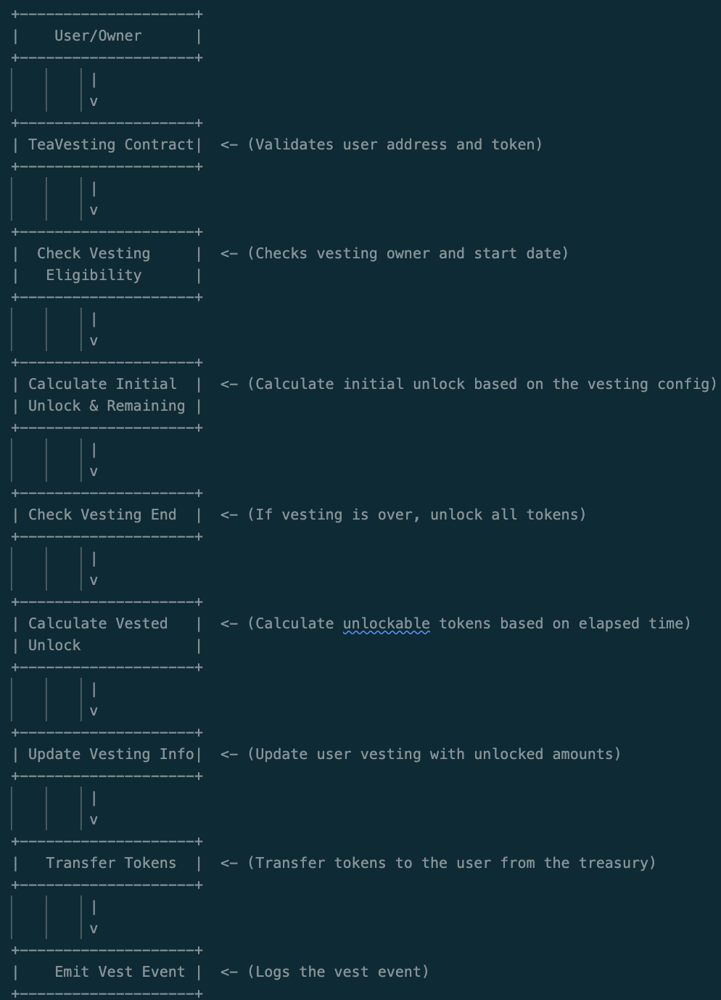
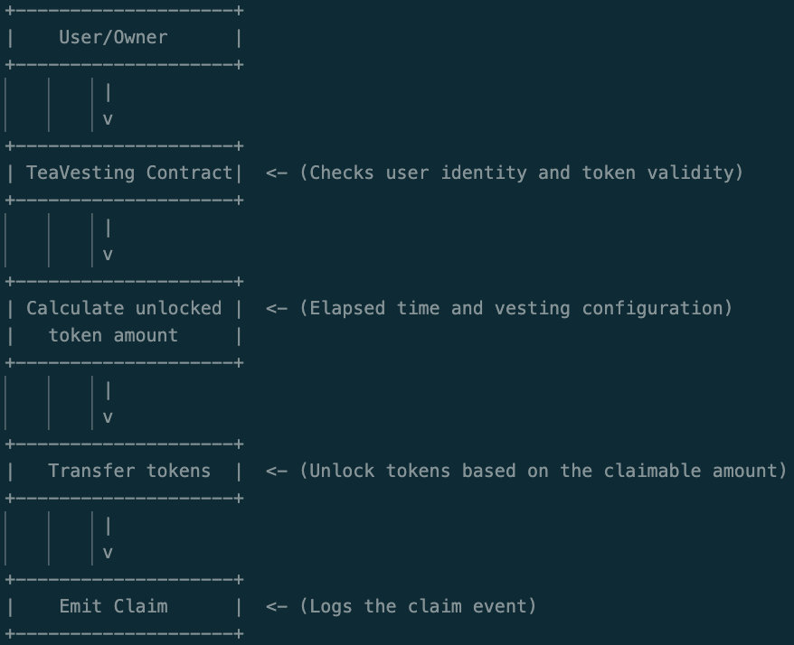
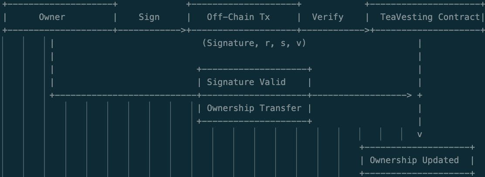
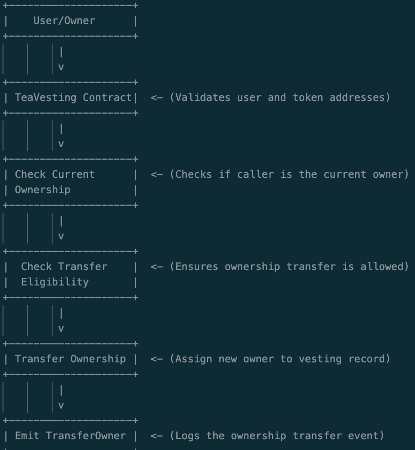

# Vesting

<!-- [](https://github.com/Syndika-Corp/solidity-project-template/actions)
[](https://codecov.io/gh/Syndika-Corp/solidity-project-template) -->


> Vesting Contracts

## Project requirements

- Yarn >= v1.22.0
- Node >= v18.0.0

## Project Structure

This template consists of the following folders:

- `addresses` - used for storing addresses of the contracts in JSON format segregated by the network, e.g. for `Lock` contract, the deployed instances on goerli and mainnet networks will be stored in `addresses/Lock.json` directory as follows:
  
    ```
    {
        "goerli": "0xEA71eCbaf87D93092bc21139000c1348858200d2",
        "mainnet": "0x3Aa5ebB10DC797CAC828524e59A333d0A371443c"
    }
    ```
- `contracts` - utilized for storing smart-contracts written in Solidity as `.sol` files
- `deploy` - contains exported functions for smart-contract deployment, each contract should have its own TS file for this purpose
- `docs` - holds docgen and other artifacts relevant for smart-contract documentation
- `scripts` - contains entry-point files for smart-contract deployment and address logging, can be augmented with new script files correspondingly
- `test` - contains all modules for smart-contract testing
- `typechain-types` - generated contract types by typechain
- `coverage` - the test coverage report

All necessary constants for deployment separated by network name can be stored in `./constants.ts`.

This project comes with a sample contract, a test for that contract, and relevant scripts for contract deployment.

---

## Scripts

### Install dependencies

`yarn` or `yarn install`

### Run local node

`yarn chain`

### Get test coverage

`yarn coverage`

### Generate contracts' docs

`yarn docs`

### Compile contracts

`yarn compile`

### Build package

`yarn build`

### Deploy contracts

`yarn deploy <network_name>`

### Run tests

`yarn test`


---

## Publishing NPM package

> The package stores contract `types` and `deployment infrormation` to integrate the contracts in other Dapp parts

- NPM account login: `yarn login`

- Publish package: `yarn publish --access restricted`


### Vesting Contract Overview
The Vesting contract is designed to handle token vesting and claiming processes. It includes secure mechanisms such as EIP712 for signature verification and is integrated with SafeERC20 for secure token transfers. Below is a breakdown of its key components:

### Key Features
- Vesting Management: The contract manages token vesting schedules for different users.
- Claim Functionality: Users can claim their vested tokens according to the vesting schedule.
- Ownership Transfers: The contract supports both on-chain and off-chain transfers of ownership rights using signatures.
- Safe Transfers: It uses OpenZeppelin’s SafeERC20 to ensure secure token operations.

### Ownership Transfers

- We using ownership transfer logic for transfer ownership to our another contract which can claim user tokens;
- When a user transfers ownership of a token to another address, the user can no longer claim or vest for the token that was transferred ownership;
 

### Core Data Structures
1. UserVesting
This structure tracks the amount of tokens each user has for vesting and how much they've already claimed.
``` 
struct UserVesting {
    uint256 tokensForVesting;
    uint256 totalVestingClaimed; 
}
```
2. VestingOption
Defines the vesting terms for each token:

- Start and end dates
- Vesting duration
- The initial percentage of tokens unlocked upon vesting

```
struct VestingOption {
    uint256 dateEnd;
    uint256 dateStart;
    uint256 dateDuration;
    uint256 percentUnlock;
}
```

3. OffChainStruct
This is used for off-chain ownership transfers, containing signature information.
`struct OffChainStruct {
    address token;
    address from;
    address to;
    uint256 deadline;
    uint8 v;
    bytes32 r;
    bytes32 s;
}`
###

Key Functions

1. claim
Allows users to claim their unlocked tokens based on the vesting schedule. It checks if the user has any tokens to claim and ensures they haven't exceeded their claim limit.

`function claim(address _tokenAddr, address _userAddr) public`

2. vest
Allows users to vest their tokens and determines how many tokens are initially unlocked and how many will be unlocked over time.

`function vest(address _tokenAddr, address _userAddr, uint256 _tokenAmount) external`

3. transferOwnerOnChain
Transfers ownership of the vesting contract on-chain. It ensures only the current owner can initiate this.

`function transferOwnerOnChain(address _tokenAddr, address _from, address _owner) external`

4. transferOwnerOffChain
Transfers ownership of the vesting contract using an off-chain signature.

`function transferOwnerOffChain(OffChainStruct calldata _offChainStruct) public`

###

Error Handling
The contract includes custom errors for various failure cases such as:

- OnlyStakingContract(): Ensures only the staking contract can interact.
- OnlyVestingOwner(): Prevents unauthorized users from claiming tokens.
- SignatureExpired(): Handles expired signatures for off-chain transactions.
- UserIsNotExist(): Thrown when a user without vesting records attempts to claim tokens.
- VestingDisabledForYou(): Raised when a user tries to vest but is not allowed (e.g., their vesting rights have been transferred).
- VestingDoesNotStart(): Thrown when a user attempts to vest tokens before the vesting period begins.
- VestingNothingToClaim(): Raised when a user attempts to claim tokens but has nothing left to claim.
- SignatureInvalid(): Occurs when an off-chain signature is invalid during ownership transfers.

# Diagram 1: Vest


# Diagram 2: Claim Flow



# Diagram 3: Off-Chain Ownership Transfer


# Diagram 4: On-Chain Ownership Transfer


